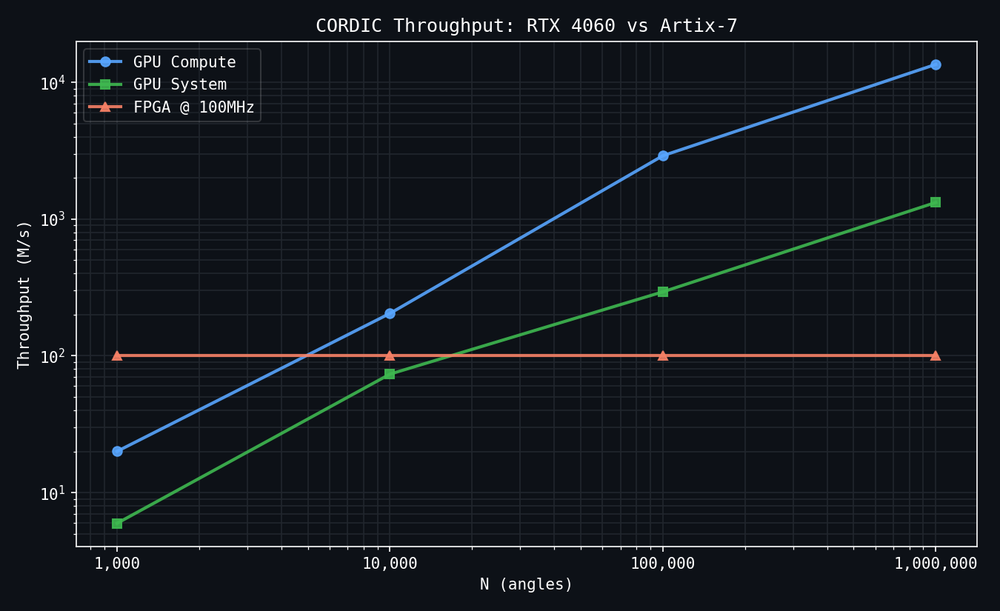
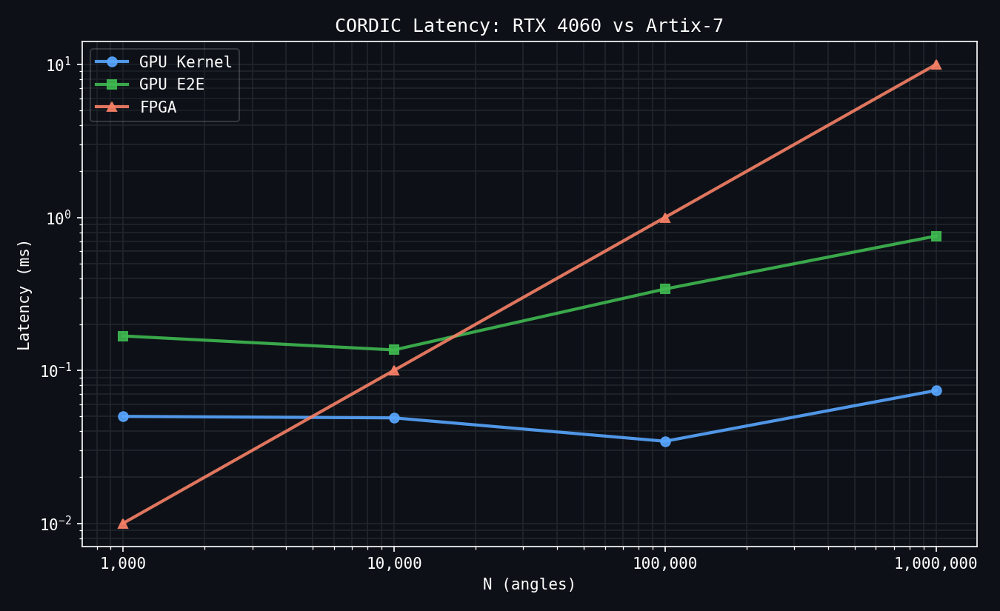
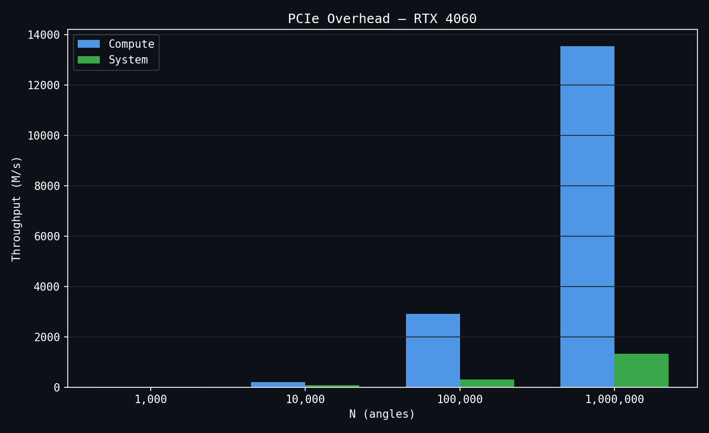
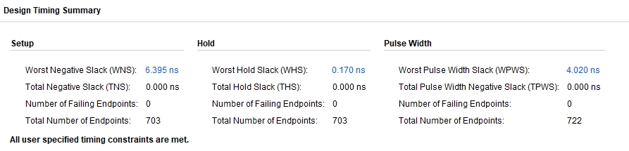

# CORDIC: Heterogeneous Performance Benchmark

A hardware-software co-design study comparing fixed-point CORDIC implementations across FPGA and GPU architectures. This benchmark measures compute throughput and system latency for trigonometric function evaluation using identical Q2.14 arithmetic on both platforms.

## Overview

CORDIC (COordinate Rotation DIgital Computer) [Wiki](https://en.wikipedia.org/wiki/CORDIC#) is an iterative algorithm for computing trigonometric functions using only shifts and adds, making it well-suited for hardware implementation. This project implements a 16-iteration CORDIC in:

- **Verilog RTL** → synthesized and deployed on Xilinx Artix-7 FPGA (Basys 3 board)
- **CUDA C** → executed on NVIDIA RTX 4060 GPU

Both implementations use Q2.14 fixed-point representation (16-bit signed, 14 fractional bits) to enable fair performance comparison.

## Results

### Performance Summary

| Platform | Peak Throughput | Latency @ 1M angles | Resource Utilization |
|----------|----------------|---------------------|---------------------|
| Basys 3 FPGA @ 100MHz | 100 M/s | 10.0 ms | 723 LUTs, 715 FFs, 0 DSPs |
| RTX 4060 (compute only) | 13,540 M/s | 0.074 ms | 3072 CUDA cores |
| RTX 4060 (end-to-end) | 1,324 M/s | 0.755 ms | includes PCIe transfer |

**Key Observations**: GPU compute throughput is 135× higher than FPGA, but PCIe memory transfer overhead reduces the system-level advantage to 13×. For batch sizes above 100K angles, the GPU saturates and maintains peak throughput. Below 10K angles, FPGA and GPU system performance converge due to GPU underutilization.

### Throughput vs Batch Size


The FPGA maintains constant throughput (100 M/s) regardless of batch size due to its pipelined architecture outputting one result per clock cycle. GPU throughput scales with batch size as more CUDA cores become utilized, saturating around N=100K.

### Latency vs Batch Size


FPGA latency scales linearly with N. GPU kernel latency remains nearly constant due to massive parallelism, but end-to-end latency increases with N due to PCIe transfer time.

### PCIe Impact on GPU Performance


At N=1M, PCIe transfers account for ~90% of total execution time, reducing effective throughput from 13,540 M/s to 1,324 M/s. This demonstrates the importance of measuring system-level performance, not just kernel execution time.

---

## Architecture

### CORDIC Algorithm

CORDIC operates in rotation mode to compute cos(θ) and sin(θ):

```
x[0] = K = 0.6073  (CORDIC gain constant)
y[0] = 0
z[0] = θ           (input angle)

for i in 0..15:
    if z[i] < 0:
        x[i+1] = x[i] + (y[i] >> i)
        y[i+1] = y[i] - (x[i] >> i)
        z[i+1] = z[i] + arctan(2^-i)
    else:
        x[i+1] = x[i] - (y[i] >> i)
        y[i+1] = y[i] + (x[i] >> i)
        z[i+1] = z[i] - arctan(2^-i)

cos(θ) = x[16]
sin(θ) = y[16]
```

The algorithm converges through iterative rotations.

### FPGA Implementation

The Verilog design is a 16-stage pipeline where each stage performs one CORDIC iteration.

- **Pipeline depth**: 16 stages (one per iteration)
- **Throughput**: 1 result per clock cycle after pipeline fill
- **Latency**: 16 clock cycles
- **Clock**: 100 MHz (constrained), Fmax = 277 MHz (from synthesis)
- **Resources**: 723 LUTs, 715 flip-flops, 0 DSP blocks
- **Platform**: Xilinx Artix-7 xc7a35tcpg236-1 (Basys 3)

The design uses only combinational shifts and adders — no DSP blocks — making it extremely area-efficient. Deployed and verified on physical hardware (Basys 3 board).

### Timing Report (Vivado)


A positive Worst Negative Slack (WNS) of 6.395 ns confirms comfortable timing closure at 100 MHz.

### GPU Implementation

The CUDA kernel assigns one thread per input angle, with each thread executing all 16 CORDIC iterations sequentially.

- **Parallelism**: Thread-per-angle (up to 3072 concurrent threads per wave)
- **Memory**: Pinned host memory (`cudaMallocHost`) for faster PCIe transfers
- **Timing**: Hardware `cudaEvent_t` timers for precision measurement
- **Warm-up**: One kernel execution before timing to eliminate driver initialization overhead
- **Platform**: NVIDIA RTX 4060 (Ada Lovelace, 3072 CUDA cores, 8GB GDDR6)

---

## Methodology

### Fixed-Point Arithmetic

All implementations use **Q2.14 format**:
- 16-bit signed integer, 2 integer bits, 14 fractional bits
- Range: -2 to +1.99994 (sufficient for [-π/2, π/2])
- LSB = 2^-14 ≈ 0.000061

**CORDIC constants in Q2.14:**
- K (gain) = 0.6073 → 9949
- γ[i] = arctan(2^-i) → precomputed 16-element lookup table

### Measurement Procedure

**FPGA**: Throughput derived from clock frequency (100 MHz × 1 result/cycle = 100 M/s). Latency calculated as N / 100 MHz.

**GPU**: Two timing measurements per batch size:
1. **Kernel latency** — `cudaEventRecord` wrapping kernel launch only
2. **End-to-end latency** — `cudaEventRecord` wrapping H→D memcpy + kernel + D→H memcpy

Batch sizes swept: 1K, 10K, 100K, 1M angles. Each measurement preceded by a warm-up run.

### Validation

All implementations validated against a Python floating-point reference. 1000 test vectors generated across [-π/2, π/2].

---

## Reproducing the Results

### Prerequisites

- **FPGA**: Vivado 2023.2+, Basys 3 board
- **GPU**: CUDA 12.0+, NVIDIA GPU (compute capability 5.0+)
- **Python**: `matplotlib`, `numpy`

### FPGA

```bash
cd src/fpga
vivado -mode batch -source build.tcl
```

### GPU

```bash
cd src/gpu
nvcc cordic.cu -o cordic -O3
./cordic > ../../results/results.csv
```

Expected CSV output:
```
N,kernel_ms,e2e_ms,throughput_compute_Mps,throughput_system_Mps
1000,0.0500,0.1678,20.02,5.96
10000,0.0489,0.1360,204.38,73.53
100000,0.0344,0.3403,2909.68,293.90
1000000,0.0739,0.7553,13539.86,1323.93
```

### Plots

```bash
cd scripts
python3 plot_results.py
```

---

## Project Structure

```
cordic-benchmark/
├── data/
│   └── test_vectors.txt          # 1000 reference vectors (angle, sin, cos)
├── src/
│   ├── fpga/
│   │   ├── cordic.v              # 16-stage pipelined CORDIC RTL
│   │   ├── cordic_tb.v           # Verilog testbench
│   │   └── cordic.xdc            # Basys 3 pin constraints
│   └── gpu/
│       └── cordic.cu             # CUDA kernel + benchmark 
├── results/
│   ├── results.csv               # GPU benchmark data
│   ├── timing_summary.png        # Vivado timing report screenshot
│   ├── throughput_vs_N.png
│   ├── latency_vs_N.png
│   └── compute_vs_system.png
├── scripts/
│   └── plot_results.py           # Matplotlib plotting script
└── README.md
```

---

## Discussion

### Why PCIe Matters

The 10× gap between GPU compute and GPU system throughput shows that memory bandwidth, not compute, is the bottleneck for this workload. At N=1M, transferring 2MB of angle data over PCIe takes longer than the actual CORDIC computation. This is a common pattern for compute-light kernels — can be mitigated by including batching, GPU-resident data pipelines or overlapping transfers with CUDA streams.

### When to Use Each Platform

**FPGA** — low latency, constrained power, small batch sizes or deterministic timing requirements  
**GPU** — throughput-first workloads, large batch sizes where PCIe overhead is amortized

---

## System Configuration

| | GPU System | FPGA System |
|--|------------|-------------|
| Hardware | NVIDIA RTX 4060 (8GB GDDR6) | Digilent Basys 3 (xc7a35tcpg236-1) |
| Toolchain | CUDA 12.4, nvcc 12.4.131 | Vivado 2023.2 |
| OS / Driver | WSL2 Ubuntu 22.04 | Windows 11 |
| Clock | — | 100 MHz (onboard oscillator) |

